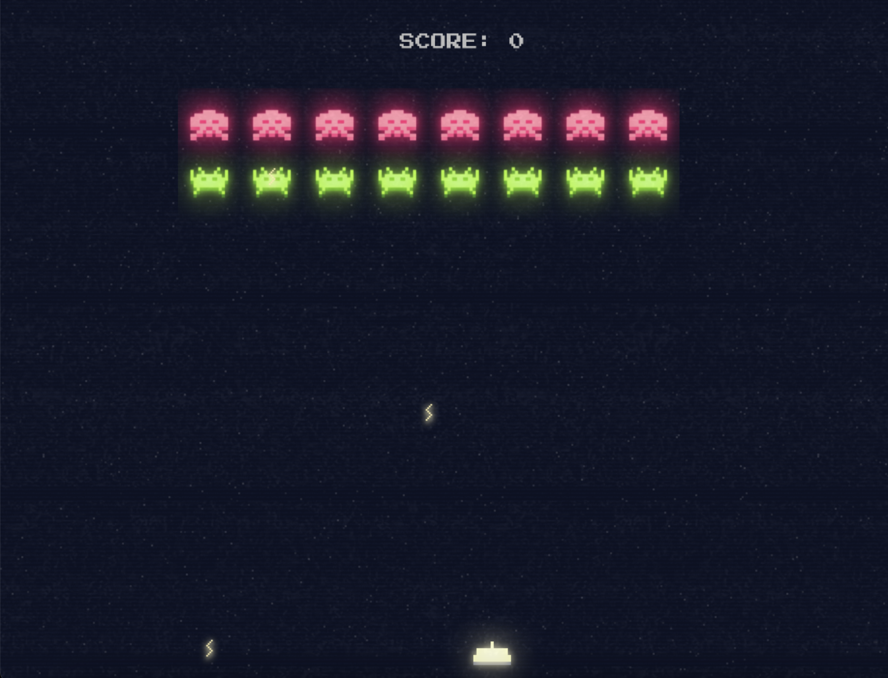

# Space Invaders JS

:construction: This Project is in development



## Getting Started

To get a local copy up and running follow these simple example steps.

### Installation

1. Clone the repo

   ```sh
   git clone https://github.com/julianosirtori/julianosirtori.dev.git
   ```
2. Start the project`

   ```sh
   npx serve
   ```
3. Access the project by opening the localhost link: http://localhost:3000 
