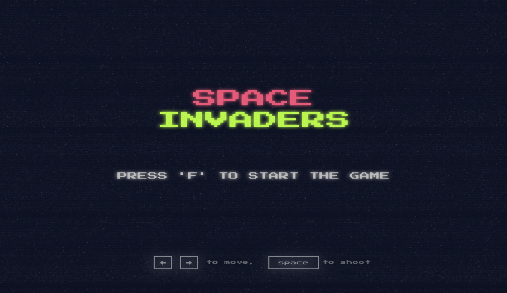

# Space Invaders in Vanilla JS

"Space Invaders" is an iconic arcade game where players defend Earth by shooting descending waves of alien invaders while avoiding their projectiles.

The goal of this project is to learn design patterns. In it, I applied these design patterns:

* State
* Observer
* Factory

[Figma Link](https://www.figma.com/community/file/1256188178472800433)



## Getting Started

To get a local copy up and running follow these simple example steps.

### Installation

1. Clone the repo

   ```sh
   git clone git@github.com:julianosirtori/space-invaders-js.git
   ```
2. Start the project`

   ```sh
   npx serve
   ```
3. Access the project by opening the localhost link: http://localhost:3000 

## Backlog

* [ ] Mutate Function
* [ ] Mobile Version
* [ ] Level System

## Contributing

Contributions are what make the open source community such an amazing place to learn, inspire, and create. Any contributions you make are **greatly appreciated**.

If you have a suggestion that would make this better, please fork the repo and create a pull request. You can also simply open an issue with the tag "enhancement".
Don't forget to give the project a star! Thanks again!

1. Fork the Project
2. Create your Feature Branch (`git checkout -b feature/AmazingFeature`)
3. Commit your Changes (`git commit -m 'Add some AmazingFeature'`)
4. Push to the Branch (`git push origin feature/AmazingFeature`)
5. Open a Pull Request

## License

Distributed under the MIT License. See `LICENSE` for more information.
